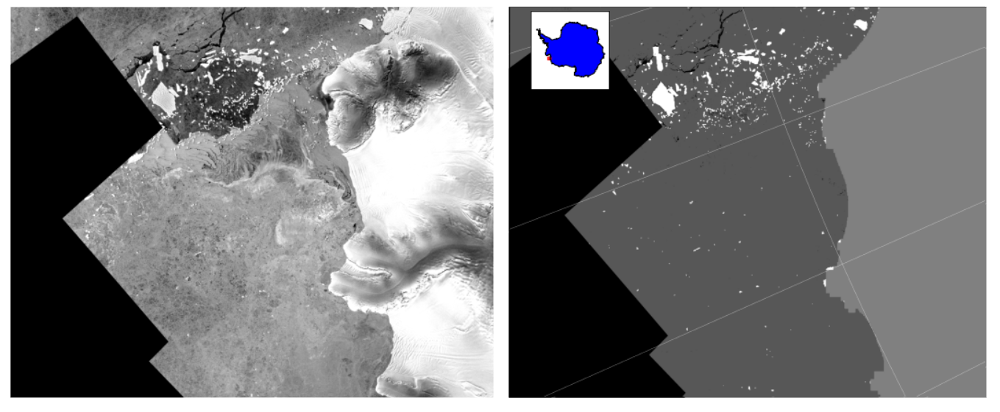

# IceDT - Machine Learning approach for automatic iceberg detection from SAR imagery.

Author: Barbat, M. M. Version 2021.1

IceDT is a framework in developement intending to improve accurate automatic iceberg detection. The framework includes an alternative machine-learning architecture focused on superpixel segmentation, deep learning, and ensemble learning with application to high-resolution Synthetic Aperture Radar (SAR) images.

Pre-processing, segmentation and classification stages are optimized intending to operate under ambiguous scenarios where sea ice, ice mélange, waves, and other artefacts common in polar environments pose major obstacles for autonomous iceberg detections.

**How to cite**: 

Barbat, M. M., Wesche, C., Werhli, A. V., & Mata, M. M. (2019). An adaptive machine learning approach to improve automatic iceberg detection from SAR images. ISPRS Journal of Photogrammetry and Remote Sensing, 156(March), 247–259. https://doi.org/10.1016/j.isprsjprs.2019.08.015

**Demonstration**. Using Radarsar RAMP AMM-1 1997 input data.

Figure: Comparison of SAR scenes from the RAMP AMM-1 mission with iceberg detection results using the autonomous detection method. White objects represents icebergs, dark gray ocean/seaice, light gray land/ice shelves and black no-data. 

Notice:
- So far supports reading SAR files in format raster.
- code is fully implemented in Python 3.x

Requeriments:

- Python 3.x
- The land mask, coastline and ice shelves vectors used for plotting are extracted from datasets provided on-line.

copyright (c) 2021 by Mauro Barbat.

Permission to use, copy, modify, and distribute this software and its documentation for any purpose and without fee is hereby granted, provided that the above copyright notices appear in all copies and that both the copyright notices and this permission notice appear in supporting documentation. THE AUTHOR DISCLAIMS ALL WARRANTIES WITH REGARD TO THIS SOFTWARE, INCLUDING ALL IMPLIED WARRANTIES OF MERCHANTABILITY AND FITNESS. IN NO EVENT SHALL THE AUTHOR BE LIABLE FOR ANY SPECIAL, INDIRECT OR CONSEQUENTIAL DAMAGES OR ANY DAMAGES WHATSOEVER RESULTING FROM LOSS OF USE, DATA OR PROFITS, WHETHER IN AN ACTION OF CONTRACT, NEGLIGENCE OR OTHER TORTIOUS ACTION, ARISING OUT OF OR IN CONNECTION WITH THE USE OR PERFORMANCE OF THIS SOFTWARE.

